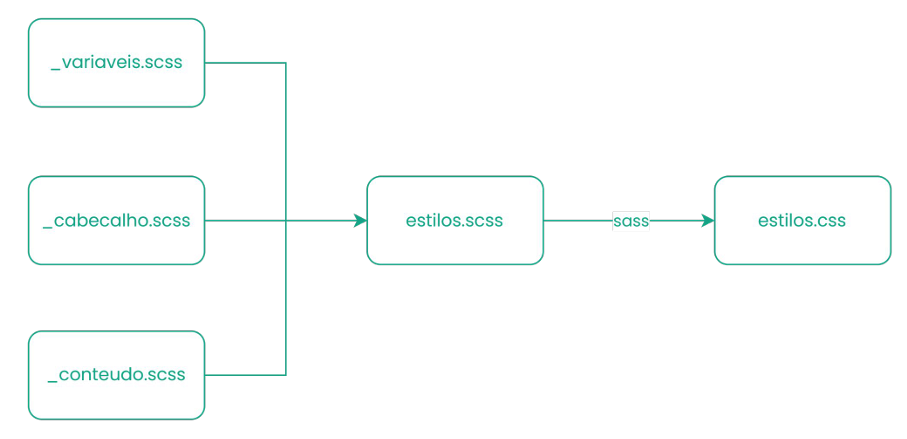

# aprendendo

# anotações da aula

- ```<meta name="viewport" content="width=device-width, inital-scale=1.0">```
    - o navegador ajusta o tamanho do conteúdo da página de acordo com o tamanho da tela do dispositivo

- % = usado baseado no tamanho do elemento pai
- rem = baseado no tamanho do root (html)
- em = baseado no tamanho do elemento pai
- vw/vh = baseado na largura/altura da tela (uma unidade é igual a 1% da altura/largura da tela)

- srcset = conseguimos definir diferentes tamanho para uma imagem (se o mecanismo não for suportado pelo navegador usamos `src`)
    - ```srcset = "imagem-pequena.jpg 600w, imagem-media.jpg 1200w, imagem-grande.jpg 1800w"```
- sizes = define o quanto de espaço o tamanho da imagem definida anteriormente pode ocupar da tela do dispositivo
    - ```sizes = "(max-width: 600px) 100vw, (max-width: 1200px) 50vw, 33vw"```


**flexbox** - usado para alinhamento vertical e horizontalmente
- `display: flex` -> no elemento pai dos elementos que vão se tornar boxes
- `flex-direction: row` -> indica que vai alinhar os elementos filhos na horizontal
- `flex-direction: column` -> indica que vai alinhar os elementos filhos na vertical
- `flex-direction: row-reverse` -> inverte a ordem dos itens na horizontal
- `flex-direction: column-reverse` -> inverte as ordens dos itens na vertical

**`justify-content`** - quando usamos `row` ou `row-reverse`
- `flex-start`: alinha à esquerda
- `flex-end`: alinha à direita
- `center`: centraliza os itens
- `space-between`: distribui os itens com espaço entre eles
- `space-around`: distribui os itens com espaço ao redor

**`align-itens`** - quando usamos `column` ou `column-reverse`
- `stretch`: preenche o container
- `flex-start`: alinha os itens no topo
- `flex-end`: alinha os itens na base
- `center`: centraliza os itens

**`gap`**
- permite criar um espaçamento entre os itens sem precisar da `margin`

**css grid**
- sistema bidimensional que permite criar uma interface com colunas e linhas ao mesmo tempo
- isso difere dos outros metodos que não permitem os dois ao mesmo tempo

```
. container {
    display: grid;
    grid-template-columns: 200px 200px 200px;
    grid-template-rows: 100px 100px;
}
```

- podemos usar frações para distribuir o espaço
    -  ```grid-template-columns: 1fr 2fr 1fr;```
- para inserir elementos podemos usar o `grid-column` e `grid-row`
- podemos definir anteriormente a estrutura do grid e posicionar elementos nomeando as áreas e atribuindo os elementos a cada uma usando o `grid-template-areas`
    - ```grid-template-areas: "header header header header" "sidebar main main aside" "footer footer footer footer"```

**bootstrap**
- framework para deixar os layouts mais responsivos e personalizáveis ainda mais rapido
- uma biblioteca de CSS + JS 
- exemplo de aplicação:
    - ```<button class="btn btn-primary">Clique Aqui</button>```
- como usar:
    - uso de cdn: linkar os arquivos de bootstrap hospedados em um CDN (content delivery network)
        - acessar o site oficial do bootstrap
        - inserir o link do CSS na tag <head>
        - inserir o script de JS na tag </body>
- *grid system*: divide a tela em 12 colunas, adapta automaticamente o conteúdo para diferentes tamanho de telas (mobile-first) e facilita a criação de layouts em colunas e linhas
    - container: define área centralizada e com margem laterais
    - row: define uma linha para agrupar colunas
    - col: define o conteúdo em colunas
- componentes pré-construídos no bootstrap: uma biblioteca imensa na documentação disponível no bootstrap

**SASS**
- Estruturar os estilos para reutilização de código, organização e manutenção facilitada.
- Pré-processador CSS que adiciona recursos avançados ao CSS tradicional, deixando o código mais eficiente e modular
    - adiciona recursos, do CSS no SASS, avançados antes que ele seja processado no código
- instale as dependencias:
    - node.js - atraves do site deles
        - pelo linux foi usando fnm com yarn
    - sass - ```npm install -g sass```

    *Variaveis e aninhamento*
    - variavel = um identificador que armazena um valor que pode ser reutilizado em várias partes do código
        - exemplo: ```$cor primaria: #ff6600;```
            - as variáveis sem começam com "$"
    - aninhamento = podemos aninhar os estilos de forma hierárquica, aninhando os elementos filho dentro do elemento pai
        - exemplo: 
        ```
        .container {
            background: #f4f4f4;
            padding: 20px;
            h1 {
                color: #333;
            }
            p {
                font-size: 18px;
            }
        }
        ``` 
        - operador &= simplifica a criação de seletores aninhados, referencia diretamente o bloco pai
    *Partial e Modules*
    - Divisão do código CSS em pequenas partes para facil manutenção e organização do projeto no geral
    - arquivos SASS com pedaços do código que não são compilados diretamente em CSS
    - no nome dos arquivos temos o **underline**: "_cores.scss", "_header.scss"
    - `@use` para importar um arquivo e encapsula seu conteúdo:
    ```
    @use 'variaveis';

    body {
        background: variaveis.$cor-primaria;
    }
    ```
    - a variavel estaria dentro do arquivo "_variaveis.scss"
    

**MIXINS, INHERITANCE E OPERATORS**
- *Mixins*
    - blocos de código reutilizáveis
```
@mixin borda-arredondada($raio: 5px){
    border-radius: $raio;
}

.botao{
    @include borda-arredondada;
}

.header{
    @include borda-arredondada(40px);
}
```
- *Inheritance*
    - capacidade de um seletor herdar os estilos de outro seletor, usando o `@extend`
    - evita duplicação de código
    - compartilha regras no css final então os seletores podem ficar longos e complexos
NO SCCS
```
.mensagem-base{
    padding: 10px;
    border-radius: 3px;
}
.mensagem-sucesso{
    @extend .mensagem-base;
    background-color: white;
    color: black;
}
```
NO CSS
```
.mensagem-base, .mensagem-sucesso{
    padding: 10px;
    border-radius: 3px;
}

.mensagem-sucesso{
    backgorund-color: white;
    color: black;
}
```
- *Operators*
    - operdores aritméticos: + - * / %
    - `@use "sass:math"`

**Tailwind CSS**
- framework de conjunto de classes utilitárias para aplicar os estilos diretamente no HTML
- diferentemente do bootstrap, ele é totalmente estilizavel, ou seja, o desenvolvedor estiliza da forma que quiser
- menos código css final 
- padronização visual 
- bg = background, text = formatação do texto, mt = margem top, font = estilização da fonte
- todas as características e formas de aplicar estão na documentação do tailwind css
    - com exemplos fixos de estilos, mas demonstrando oq as modificações afetam no estilo